# Wafa — Complete Database Schema

Generated from the live database (`loyalty_cards`, MySQL 8.4.3) on 2026-09-27. 31 tables, 264 columns, 28 foreign keys. Every column, type, default, index and foreign key below is read from the database itself; descriptions come from the code and the requirements (v1.0).

For the reasoning behind the design, see [database-schema.md](database-schema.md).

## Contents

1. [Conventions](#conventions)
2. [Domains](#domains)
3. [Entity–relationship diagram](#entityrelationship-diagram)
4. [Tables](#tables)
5. [All relationships](#all-relationships)
6. [Enumerations](#enumerations)
7. [Rules the schema enforces](#rules-the-schema-enforces)
8. [Runtime settings](#runtime-settings)

## Conventions

- **Primary keys** are `id` BIGINT UNSIGNED auto-increment (except `notifications.id`, a UUID, and framework tables).
- **Foreign keys** are named `<singular>_id` and point to `id`. Actor columns point to `admin_users`: `reviewed_by_admin_id`, `cancelled_by_admin_id`, `handled_by_admin_id`, `created_by_admin_id`.
- **Status and type columns** are VARCHAR holding an enum value (see [Enumerations](#enumerations)), not MySQL ENUM, so adding a value needs no migration.
- **Money** is DECIMAL: prices in USD, payments also store the exchange rate and the SYP amount.
- **Phones** are E.164 (`+9639XXXXXXXX`). **Times** are TIMESTAMP in UTC. **Files** are relative storage paths (`*_path`).
- **Polymorphic columns** (`*_type` + `*_id`) store short aliases: `customer`, `merchant`, `admin`.
- **Soft deletes** (`deleted_at`): `customers`, `merchants`. **Deactivation instead of deletion** (`is_active`): `admin_users`, `governorates`, `business_types`, `icons`, `packages`.
- **No passwords are stored.** Customers sign in with phone + WhatsApp OTP; merchants and admins through Clerk, linked by `clerk_user_id`.

## Domains

| Domain | Tables |
|---|---|
| Managed lists | [`governorates`](#governorates), [`business_types`](#business_types), [`icons`](#icons), [`settings`](#settings) |
| Identity & consent | [`customers`](#customers), [`policy_consents`](#policy_consents), [`otp_codes`](#otp_codes), [`admin_users`](#admin_users) |
| Merchant & subscription | [`merchants`](#merchants), [`trial_email_hashes`](#trial_email_hashes), [`packages`](#packages), [`package_prices`](#package_prices), [`subscription_periods`](#subscription_periods), [`payments`](#payments) |
| Cards, cycles & stamps | [`cards`](#cards), [`card_cycles`](#card_cycles), [`stamps`](#stamps) |
| Campaigns & preferences | [`campaigns`](#campaigns), [`merchant_mutes`](#merchant_mutes), [`birthday_greetings`](#birthday_greetings) |
| Requests & audit | [`deletion_requests`](#deletion_requests), [`audit_logs`](#audit_logs) |
| Devices, tokens & notifications | [`device_tokens`](#device_tokens), [`personal_access_tokens`](#personal_access_tokens), [`notifications`](#notifications) |
| Framework internals | [`cache`](#cache), [`cache_locks`](#cache_locks), [`jobs`](#jobs), [`job_batches`](#job_batches), [`failed_jobs`](#failed_jobs), [`migrations`](#migrations) |

## Entity–relationship diagram

All domain tables with every column. `PK` primary key, `FK` foreign key, `UK` unique. Dotted lines are polymorphic links (no database foreign key). Framework internals (cache, jobs, migrations) are omitted — they relate to nothing.

```mermaid
erDiagram
    governorates {
        bigint id PK
        string name UK
        smallint sort_order
        boolean is_active
        timestamp created_at
        timestamp updated_at
    }
    business_types {
        bigint id PK
        string name UK
        smallint sort_order
        boolean is_active
        timestamp created_at
        timestamp updated_at
    }
    icons {
        bigint id PK
        string key UK
        string name
        smallint sort_order
        boolean is_active
        timestamp created_at
        timestamp updated_at
    }
    settings {
        bigint id PK
        string key UK
        json value
        timestamp created_at
        timestamp updated_at
    }
    customers {
        bigint id PK
        string phone UK
        string name
        date birthdate
        string qr_id UK
        string qr_secret
        boolean campaigns_muted
        timestamp registered_at
        timestamp last_activity_at
        timestamp last_login_at
        timestamp created_at
        timestamp updated_at
        timestamp deleted_at
    }
    policy_consents {
        bigint id PK
        bigint customer_id FK
        string policy_version
        timestamp consented_at
        timestamp created_at
        timestamp updated_at
    }
    otp_codes {
        bigint id PK
        string phone
        string code_hash
        string channel
        tinyint attempts
        timestamp expires_at
        timestamp consumed_at
        string ip_address
        timestamp created_at
        timestamp updated_at
    }
    admin_users {
        bigint id PK
        string clerk_user_id UK
        string name
        string email UK
        string role
        boolean is_active
        timestamp last_login_at
        timestamp created_at
        timestamp updated_at
    }
    merchants {
        bigint id PK
        string clerk_user_id UK
        string email
        string business_name
        bigint business_type_id FK
        bigint governorate_id FK
        string address
        string owner_name
        string phone UK
        string logo_path
        string pin_hash
        string status
        timestamp suspended_at
        string suspension_reason
        timestamp last_login_at
        timestamp created_at
        timestamp updated_at
        timestamp deleted_at
    }
    trial_email_hashes {
        bigint id PK
        string email_hash UK
        timestamp created_at
        timestamp updated_at
    }
    packages {
        bigint id PK
        string name
        tinyint cards_limit
        tinyint weekly_campaigns_limit
        boolean is_active
        smallint sort_order
        timestamp created_at
        timestamp updated_at
    }
    package_prices {
        bigint id PK
        bigint package_id FK
        tinyint duration_months
        decimal price_usd
        timestamp created_at
        timestamp updated_at
    }
    subscription_periods {
        bigint id PK
        bigint merchant_id FK
        bigint package_id FK
        string type
        tinyint duration_months
        timestamp starts_at
        timestamp ends_at
        timestamp grace_ends_at
        bigint created_by_admin_id FK
        string note
        timestamp created_at
        timestamp updated_at
    }
    payments {
        bigint id PK
        bigint merchant_id FK
        bigint package_id FK
        tinyint duration_months
        decimal price_usd
        decimal exchange_rate
        decimal amount_syp
        string method
        string reference
        string proof_path
        string status
        string rejection_reason
        bigint reviewed_by_admin_id FK
        timestamp reviewed_at
        bigint subscription_period_id FK
        timestamp created_at
        timestamp updated_at
        bigint pending_for_merchant UK
    }
    cards {
        bigint id PK
        bigint merchant_id FK
        bigint icon_id FK
        string name
        tinyint stamps_required
        string reward_description
        text terms
        string status
        timestamp suspended_at
        timestamp created_at
        timestamp updated_at
    }
    card_cycles {
        bigint id PK
        bigint card_id FK
        bigint customer_id FK
        bigint merchant_id FK
        smallint stamps_count
        string status
        timestamp completed_at
        timestamp redeemed_at
        timestamp created_at
        timestamp updated_at
        bigint open_card_id
        bigint open_customer_id
    }
    stamps {
        bigint id PK
        bigint card_cycle_id FK
        bigint card_id FK
        bigint customer_id FK
        bigint merchant_id FK
        string method
        string client_uuid UK
        timestamp stamped_at
        timestamp cancelled_at
        string cancel_reason
        bigint cancelled_by_admin_id FK
        timestamp created_at
        timestamp updated_at
    }
    campaigns {
        bigint id PK
        bigint merchant_id FK
        string title
        text body
        int recipients_count
        timestamp sent_at
        timestamp created_at
        timestamp updated_at
    }
    merchant_mutes {
        bigint id PK
        bigint customer_id FK
        bigint merchant_id FK
        timestamp created_at
        timestamp updated_at
    }
    birthday_greetings {
        bigint id PK
        bigint merchant_id FK
        bigint customer_id FK
        date greeted_on
        timestamp created_at
        timestamp updated_at
    }
    deletion_requests {
        bigint id PK
        string subject_type
        bigint subject_id
        string source
        timestamp requested_at
        timestamp executes_at
        timestamp executed_at
        timestamp cancelled_at
        bigint handled_by_admin_id FK
        string note
        timestamp created_at
        timestamp updated_at
    }
    audit_logs {
        bigint id PK
        bigint admin_user_id FK
        string action
        string subject_type
        bigint subject_id
        json before
        json after
        string ip_address
        timestamp created_at
    }
    device_tokens {
        bigint id PK
        string owner_type
        bigint owner_id
        string token UK
        string platform
        string app
        timestamp last_seen_at
        timestamp created_at
        timestamp updated_at
    }
    personal_access_tokens {
        bigint id PK
        string tokenable_type
        bigint tokenable_id
        text name
        string token UK
        text abilities
        timestamp last_used_at
        timestamp expires_at
        timestamp created_at
        timestamp updated_at
    }
    notifications {
        string id PK
        string type
        string notifiable_type
        bigint notifiable_id
        text data
        timestamp read_at
        timestamp created_at
        timestamp updated_at
    }
    admin_users |o--o{ audit_logs : "admin_user_id"
    customers ||--o{ birthday_greetings : "customer_id"
    merchants ||--o{ birthday_greetings : "merchant_id"
    merchants ||--o{ campaigns : "merchant_id"
    cards ||--o{ card_cycles : "card_id"
    customers ||--o{ card_cycles : "customer_id"
    merchants ||--o{ card_cycles : "merchant_id"
    icons ||--o{ cards : "icon_id"
    merchants ||--o{ cards : "merchant_id"
    admin_users |o--o{ deletion_requests : "handled_by_admin_id"
    customers ||--o{ merchant_mutes : "customer_id"
    merchants ||--o{ merchant_mutes : "merchant_id"
    business_types ||--o{ merchants : "business_type_id"
    governorates ||--o{ merchants : "governorate_id"
    packages ||--o{ package_prices : "package_id"
    merchants ||--o{ payments : "merchant_id"
    packages ||--o{ payments : "package_id"
    admin_users |o--o{ payments : "reviewed_by_admin_id"
    subscription_periods |o--o{ payments : "subscription_period_id"
    customers ||--o{ policy_consents : "customer_id"
    admin_users |o--o{ stamps : "cancelled_by_admin_id"
    card_cycles ||--o{ stamps : "card_cycle_id"
    cards ||--o{ stamps : "card_id"
    customers ||--o{ stamps : "customer_id"
    merchants ||--o{ stamps : "merchant_id"
    admin_users |o--o{ subscription_periods : "created_by_admin_id"
    merchants ||--o{ subscription_periods : "merchant_id"
    packages ||--o{ subscription_periods : "package_id"
    customers ||..o{ device_tokens : "owner (morph)"
    merchants ||..o{ device_tokens : "owner (morph)"
    customers ||..o{ personal_access_tokens : "tokenable (morph)"
    customers ||..o{ notifications : "notifiable (morph)"
    merchants ||..o{ notifications : "notifiable (morph)"
    customers ||..o{ deletion_requests : "subject (type+id)"
    merchants ||..o{ deletion_requests : "subject (type+id)"
    customers ||..o{ otp_codes : "phone (by value)"
```

## Tables

### Managed lists

#### `governorates`

The 14 Syrian governorates. Used by merchant registration and the directory filter. Deactivated, never deleted.

| Column | Type | Null | Default | Key | Notes |
|---|---|---|---|---|---|
| `id` | bigint unsigned auto_increment | no |  | PK |  |
| `name` | varchar(100) | no |  | UNIQUE |  |
| `sort_order` | smallint unsigned | no | `0` |  |  |
| `is_active` | tinyint(1) | no | `1` |  |  |
| `created_at` | timestamp | yes |  |  |  |
| `updated_at` | timestamp | yes |  |  |  |

**Indexes:** UNIQUE (name)

#### `business_types`

Business categories (café, restaurant, sweets…). Managed from the dashboard; deactivated, never deleted, so old shops keep resolving.

| Column | Type | Null | Default | Key | Notes |
|---|---|---|---|---|---|
| `id` | bigint unsigned auto_increment | no |  | PK |  |
| `name` | varchar(100) | no |  | UNIQUE |  |
| `sort_order` | smallint unsigned | no | `0` |  |  |
| `is_active` | tinyint(1) | no | `1` |  |  |
| `created_at` | timestamp | yes |  |  |  |
| `updated_at` | timestamp | yes |  |  |  |

**Indexes:** UNIQUE (name)

#### `icons`

Card icon library. Merchants pick an icon instead of uploading an image; the apps draw it by `key`.

| Column | Type | Null | Default | Key | Notes |
|---|---|---|---|---|---|
| `id` | bigint unsigned auto_increment | no |  | PK |  |
| `key` | varchar(64) | no |  | UNIQUE |  |
| `name` | varchar(100) | no |  |  |  |
| `sort_order` | smallint unsigned | no | `0` |  |  |
| `is_active` | tinyint(1) | no | `1` |  |  |
| `created_at` | timestamp | yes |  |  |  |
| `updated_at` | timestamp | yes |  |  |  |

**Indexes:** UNIQUE (key)

#### `settings`

Key/JSON store for runtime values edited from the dashboard (trial length, grace days, stamp limits, QR period, policy version, minimum app version…). Read at runtime, so changing one needs no deploy.

| Column | Type | Null | Default | Key | Notes |
|---|---|---|---|---|---|
| `id` | bigint unsigned auto_increment | no |  | PK |  |
| `key` | varchar(100) | no |  | UNIQUE |  |
| `value` | json | no |  |  | JSON value (number, string, …). |
| `created_at` | timestamp | yes |  |  |  |
| `updated_at` | timestamp | yes |  |  |  |

**Indexes:** UNIQUE (key)

### Identity & consent

#### `customers`

A customer, identified by phone. A row with `registered_at` NULL is a *pending* customer a merchant added by phone before they installed the app; signing up fills the same row. A deleted account is emptied in place and soft deleted.

| Column | Type | Null | Default | Key | Notes |
|---|---|---|---|---|---|
| `id` | bigint unsigned auto_increment | no |  | PK |  |
| `phone` | varchar(20) | yes |  | UNIQUE | E.164 (`+9639XXXXXXXX`). The customer's identity. NULL only on a deleted (anonymised) row, so the number can sign up again. |
| `name` | varchar(255) | yes |  |  | NULL for a pending customer. |
| `birthdate` | date | yes |  |  | Age must be 13+. Never sent to the merchant app with the year. Not editable from the app. |
| `qr_id` | varchar(12) | yes |  | UNIQUE | Random 12-character id carried in the QR code (`W1.{qr_id}.{code}`) instead of the sequential id. Emptied on account deletion. |
| `qr_secret` | varchar(64) | yes |  |  | Base32 TOTP secret (HMAC-SHA256, 8 digits) the customer app generates the rotating QR code with, offline. Never exposed to merchants. |
| `campaigns_muted` | tinyint(1) | no | `0` |  | Switches off offers from every merchant. |
| `registered_at` | timestamp | yes |  |  | NULL = pending customer (phone only, added by a merchant). |
| `last_activity_at` | timestamp | yes |  |  | Drives the 12-month purge of pending customers. |
| `last_login_at` | timestamp | yes |  |  |  |
| `created_at` | timestamp | yes |  |  |  |
| `updated_at` | timestamp | yes |  |  |  |
| `deleted_at` | timestamp | yes |  |  | Soft delete. Set when the account is deleted; the row is emptied of personal data and kept for merchant statistics. |

**Indexes:** (last_activity_at) · UNIQUE (phone) · UNIQUE (qr_id)

#### `policy_consents`

One row per privacy-policy version a customer agreed to, with the time.

| Column | Type | Null | Default | Key | Notes |
|---|---|---|---|---|---|
| `id` | bigint unsigned auto_increment | no |  | PK |  |
| `customer_id` | bigint unsigned | no |  | FK → `customers.id` |  |
| `policy_version` | varchar(16) | no |  |  | e.g. `1.2`. Unique per customer. |
| `consented_at` | timestamp | no |  |  |  |
| `created_at` | timestamp | yes |  |  |  |
| `updated_at` | timestamp | yes |  |  |  |

**Indexes:** UNIQUE (customer_id, policy_version)

#### `otp_codes`

Hashes of WhatsApp verification codes. Only the hash is stored; a code is consumed once.

| Column | Type | Null | Default | Key | Notes |
|---|---|---|---|---|---|
| `id` | bigint unsigned auto_increment | no |  | PK |  |
| `phone` | varchar(20) | no |  |  | E.164. |
| `code_hash` | varchar(255) | no |  |  | bcrypt hash of the 6-digit code. |
| `channel` | varchar(16) | no | `whatsapp` |  |  |
| `attempts` | tinyint unsigned | no | `0` |  | Wrong tries; the code dies after 5. |
| `expires_at` | timestamp | no |  |  | 5 minutes after issue. |
| `consumed_at` | timestamp | yes |  |  | Set once the code signed someone in. |
| `ip_address` | varchar(45) | yes |  |  |  |
| `created_at` | timestamp | yes |  |  |  |
| `updated_at` | timestamp | yes |  |  |  |

**Indexes:** (phone, created_at)

#### `admin_users`

Dashboard accounts with one of four roles. Added by a super admin by email; `clerk_user_id` stays NULL until the owner of that email first signs in to Clerk. Deactivated, never deleted.

| Column | Type | Null | Default | Key | Notes |
|---|---|---|---|---|---|
| `id` | bigint unsigned auto_increment | no |  | PK |  |
| `clerk_user_id` | varchar(64) | yes |  | UNIQUE | Clerk `user_…` id. NULL until the first sign-in with this email links it. |
| `name` | varchar(255) | no |  |  |  |
| `email` | varchar(255) | no |  | UNIQUE | Stored lowercase; the first-sign-in link matches the Clerk email against it. |
| `role` | varchar(32) | no |  |  | Values: `super_admin` · `admin` · `payments_reviewer` · `support`. |
| `is_active` | tinyint(1) | no | `1` |  | Deactivating replaces deleting, so the audit trail keeps its author. |
| `last_login_at` | timestamp | yes |  |  |  |
| `created_at` | timestamp | yes |  |  |  |
| `updated_at` | timestamp | yes |  |  |  |

**Indexes:** UNIQUE (clerk_user_id) · UNIQUE (email)

### Merchant & subscription

#### `merchants`

A shop. One account shared by the owner and the cashier (Clerk sign-in); sensitive tabs are behind the PIN. Filled in three registration steps. Soft deleted.

| Column | Type | Null | Default | Key | Notes |
|---|---|---|---|---|---|
| `id` | bigint unsigned auto_increment | no |  | PK |  |
| `clerk_user_id` | varchar(64) | no |  | UNIQUE | Clerk `user_…` id of the shop's sign-in. |
| `email` | varchar(255) | yes |  |  | Copied from the Clerk session token, never from request input. Kept in step on each app start and by the Clerk webhook. |
| `business_name` | varchar(255) | no |  |  | Editable by support only. |
| `business_type_id` | bigint unsigned | no |  | FK → `business_types.id` |  |
| `governorate_id` | bigint unsigned | no |  | FK → `governorates.id` |  |
| `address` | varchar(255) | yes |  |  | Optional line shown on the shop page in the directory. |
| `owner_name` | varchar(255) | no |  |  |  |
| `phone` | varchar(20) | no |  | UNIQUE | Shop contact number (E.164), not a sign-in. |
| `logo_path` | varchar(255) | yes |  |  | Relative storage path (`merchants/logos/…`). |
| `pin_hash` | varchar(255) | yes |  |  | bcrypt hash of the 4–6 digit PIN. NULL until registration step 3. |
| `status` | varchar(32) | yes |  |  | NULL until a package is chosen (registration step 2). Values: `TRIAL` · `ACTIVE` · `GRACE` · `EXPIRED` · `SUSPENDED` · `PENDING_DELETION` · `DELETED`. |
| `suspended_at` | timestamp | yes |  |  | Set when an admin suspends the shop (fraud or violation). |
| `suspension_reason` | varchar(255) | yes |  |  | Mandatory reason for the suspension. |
| `last_login_at` | timestamp | yes |  |  | Last time the merchant app called `me`. |
| `created_at` | timestamp | yes |  |  |  |
| `updated_at` | timestamp | yes |  |  |  |
| `deleted_at` | timestamp | yes |  |  | Soft delete. |

**Indexes:** (business_type_id) · UNIQUE (clerk_user_id) · (email) · (governorate_id, business_type_id) · UNIQUE (phone) · (status)

#### `trial_email_hashes`

HMAC fingerprints of merchant emails that already used the free trial. No foreign key on purpose: it outlives the merchant so a deleted-and-recreated account cannot get a second trial.

| Column | Type | Null | Default | Key | Notes |
|---|---|---|---|---|---|
| `id` | bigint unsigned auto_increment | no |  | PK |  |
| `email_hash` | varchar(64) | no |  | UNIQUE | HMAC-SHA256 of the lowercased email with the app key; the email cannot be recovered from it. |
| `created_at` | timestamp | yes |  |  |  |
| `updated_at` | timestamp | yes |  |  |  |

**Indexes:** UNIQUE (email_hash)

#### `packages`

Subscription packages: how many cards and how many campaigns per week.

| Column | Type | Null | Default | Key | Notes |
|---|---|---|---|---|---|
| `id` | bigint unsigned auto_increment | no |  | PK |  |
| `name` | varchar(100) | no |  |  |  |
| `cards_limit` | tinyint unsigned | no |  |  | Active cards allowed (1 / 2 / 5). |
| `weekly_campaigns_limit` | tinyint unsigned | no |  |  | Campaigns allowed per week. |
| `is_active` | tinyint(1) | no | `1` |  |  |
| `sort_order` | smallint unsigned | no | `0` |  |  |
| `created_at` | timestamp | yes |  |  |  |
| `updated_at` | timestamp | yes |  |  |  |

#### `package_prices`

The price matrix: one row per (package, duration in months), in USD.

| Column | Type | Null | Default | Key | Notes |
|---|---|---|---|---|---|
| `id` | bigint unsigned auto_increment | no |  | PK |  |
| `package_id` | bigint unsigned | no |  | FK → `packages.id` |  |
| `duration_months` | tinyint unsigned | no |  |  | 1, 3 or 12. |
| `price_usd` | decimal(8,2) | no |  |  | Current price. Payments copy it at upload time. |
| `created_at` | timestamp | yes |  |  |  |
| `updated_at` | timestamp | yes |  |  |  |

**Indexes:** UNIQUE (package_id, duration_months)

#### `subscription_periods`

One row per trial or paid period, keeping the full history. A renewal extends from the previous `ends_at`.

| Column | Type | Null | Default | Key | Notes |
|---|---|---|---|---|---|
| `id` | bigint unsigned auto_increment | no |  | PK |  |
| `merchant_id` | bigint unsigned | no |  | FK → `merchants.id` |  |
| `package_id` | bigint unsigned | no |  | FK → `packages.id` |  |
| `type` | varchar(16) | no |  |  | Values: `trial` · `paid`. |
| `duration_months` | tinyint unsigned | yes |  |  | NULL for a trial. |
| `starts_at` | timestamp | no |  |  |  |
| `ends_at` | timestamp | no |  |  |  |
| `grace_ends_at` | timestamp | yes |  |  | Only after a paid period, never after a trial (default 3 days). |
| `created_by_admin_id` | bigint unsigned | yes |  | FK → `admin_users.id` | Set for manual extensions granted by a super admin. |
| `note` | varchar(255) | yes |  |  |  |
| `created_at` | timestamp | yes |  |  |  |
| `updated_at` | timestamp | yes |  |  |  |

**Indexes:** (created_by_admin_id) · (merchant_id, ends_at) · (package_id)

#### `payments`

A merchant's uploaded payment proof and its review. Prices and exchange rate are **copied** in at upload time, so later price changes never alter what this merchant paid.

| Column | Type | Null | Default | Key | Notes |
|---|---|---|---|---|---|
| `id` | bigint unsigned auto_increment | no |  | PK |  |
| `merchant_id` | bigint unsigned | no |  | FK → `merchants.id` |  |
| `package_id` | bigint unsigned | no |  | FK → `packages.id` |  |
| `duration_months` | tinyint unsigned | no |  |  | Copied from the price matrix at upload. |
| `price_usd` | decimal(8,2) | no |  |  | Copied at upload. |
| `exchange_rate` | decimal(12,4) | no |  |  | SYP per USD, copied at upload. |
| `amount_syp` | decimal(15,2) | no |  |  | price_usd × exchange_rate, copied at upload. |
| `method` | varchar(32) | no |  |  | Values: `syriatel_cash` · `transfer`. |
| `reference` | varchar(255) | yes |  |  | Optional transfer reference; the dashboard flags a reference used before. |
| `proof_path` | varchar(255) | no |  |  | Relative storage path of the proof image. |
| `status` | varchar(16) | no | `PENDING` |  | Values: `PENDING` · `APPROVED` · `REJECTED`. |
| `rejection_reason` | varchar(32) | yes |  |  | Values: `transfer_not_received` · `amount_short` · `unclear_image` · `invalid_proof`. |
| `reviewed_by_admin_id` | bigint unsigned | yes |  | FK → `admin_users.id` | The payments reviewer who decided. |
| `reviewed_at` | timestamp | yes |  |  |  |
| `subscription_period_id` | bigint unsigned | yes |  | FK → `subscription_periods.id` | The period an approval created. |
| `created_at` | timestamp | yes |  |  |  |
| `updated_at` | timestamp | yes |  |  |  |
| `pending_for_merchant` | bigint unsigned | yes |  | UNIQUE | Virtual: `merchant_id` while PENDING, else NULL. Its unique index allows **one pending payment per merchant**. Generated (virtual). |

**Indexes:** (merchant_id, status) · (package_id) · UNIQUE (pending_for_merchant) · (reviewed_by_admin_id) · (status, created_at) · (subscription_period_id)

**`pending_for_merchant`** = `(case when (status = 'PENDING') then merchant_id else NULL end)`

### Cards, cycles & stamps

#### `cards`

A loyalty card a merchant publishes. Never edited after publishing — only suspended — so customers' progress keeps pointing at the same promise.

| Column | Type | Null | Default | Key | Notes |
|---|---|---|---|---|---|
| `id` | bigint unsigned auto_increment | no |  | PK |  |
| `merchant_id` | bigint unsigned | no |  | FK → `merchants.id` |  |
| `icon_id` | bigint unsigned | no |  | FK → `icons.id` |  |
| `name` | varchar(255) | no |  |  |  |
| `stamps_required` | tinyint unsigned | no |  |  | Between the dashboard limits (default 3–10). |
| `reward_description` | varchar(255) | no |  |  | e.g. "free coffee of your choice". |
| `terms` | text | yes |  |  | Optional conditions. |
| `status` | varchar(16) | no | `active` |  | Values: `active` · `suspended`. |
| `suspended_at` | timestamp | yes |  |  | Set when suspended; a suspended card takes no new customers but existing ones can finish. |
| `created_at` | timestamp | yes |  |  |  |
| `updated_at` | timestamp | yes |  |  |  |

**Indexes:** (icon_id) · (merchant_id, status)

#### `card_cycles`

The heart of the system: a customer's progress on a card, one row per cycle from first stamp to reward handed over. Redemption closes the row; the next stamp opens a new one.

| Column | Type | Null | Default | Key | Notes |
|---|---|---|---|---|---|
| `id` | bigint unsigned auto_increment | no |  | PK |  |
| `card_id` | bigint unsigned | no |  | FK → `cards.id` |  |
| `customer_id` | bigint unsigned | no |  | FK → `customers.id` |  |
| `merchant_id` | bigint unsigned | no |  | FK → `merchants.id` | Copied from the card so merchant lists and statistics avoid a join. |
| `stamps_count` | smallint unsigned | no | `0` |  | Stamps in this cycle (cancelled stamps are subtracted). |
| `status` | varchar(16) | no | `COLLECTING` |  | Values: `COLLECTING` · `REWARD_READY` · `REDEEMED`. |
| `completed_at` | timestamp | yes |  |  | When the card filled up (REWARD_READY). |
| `redeemed_at` | timestamp | yes |  |  | When the reward was handed over (REDEEMED). |
| `created_at` | timestamp | yes |  |  |  |
| `updated_at` | timestamp | yes |  |  |  |
| `open_card_id` | bigint unsigned | yes |  |  | Virtual: `card_id` until REDEEMED, then NULL. Generated (virtual). |
| `open_customer_id` | bigint unsigned | yes |  |  | Virtual: `customer_id` until REDEEMED, then NULL. With `open_card_id` it is unique: **one open cycle per (card, customer)**. Generated (virtual). |

**Indexes:** (card_id) · (customer_id, status) · (merchant_id, updated_at) · UNIQUE (open_card_id, open_customer_id)

**`open_card_id`** = `(case when (status <> 'REDEEMED') then card_id else NULL end)`

**`open_customer_id`** = `(case when (status <> 'REDEEMED') then customer_id else NULL end)`

#### `stamps`

One row per scan (or phone entry). A cancelled stamp is marked, never deleted. `client_uuid` makes a double tap or a retried request count once.

| Column | Type | Null | Default | Key | Notes |
|---|---|---|---|---|---|
| `id` | bigint unsigned auto_increment | no |  | PK |  |
| `card_cycle_id` | bigint unsigned | no |  | FK → `card_cycles.id` |  |
| `card_id` | bigint unsigned | no |  | FK → `cards.id` | Denormalised from the cycle for statistics. |
| `customer_id` | bigint unsigned | no |  | FK → `customers.id` | Denormalised from the cycle. |
| `merchant_id` | bigint unsigned | no |  | FK → `merchants.id` | Denormalised from the cycle. |
| `method` | varchar(16) | no |  |  | Values: `qr` · `phone`. |
| `client_uuid` | char(36) | no |  | UNIQUE | Generated by the merchant app per operation. Unique: a retry never adds a second stamp. |
| `stamped_at` | timestamp | no |  |  |  |
| `cancelled_at` | timestamp | yes |  |  | Cancellation marks, never deletes. |
| `cancel_reason` | varchar(255) | yes |  |  | Mandatory written reason when an admin cancels. |
| `cancelled_by_admin_id` | bigint unsigned | yes |  | FK → `admin_users.id` | Admin who cancelled. |
| `created_at` | timestamp | yes |  |  |  |
| `updated_at` | timestamp | yes |  |  |  |

**Indexes:** (cancelled_by_admin_id) · (card_cycle_id) · (card_id, stamped_at) · UNIQUE (client_uuid) · (customer_id) · (merchant_id, stamped_at)

### Campaigns & preferences

#### `campaigns`

Text offers a merchant sends to their customers; counted per week against the package limit.

| Column | Type | Null | Default | Key | Notes |
|---|---|---|---|---|---|
| `id` | bigint unsigned auto_increment | no |  | PK |  |
| `merchant_id` | bigint unsigned | no |  | FK → `merchants.id` |  |
| `title` | varchar(255) | no |  |  |  |
| `body` | text | no |  |  |  |
| `recipients_count` | int unsigned | no | `0` |  | How many customers the campaign reached. |
| `sent_at` | timestamp | yes |  |  | Counted per week against `packages.weekly_campaigns_limit`. |
| `created_at` | timestamp | yes |  |  |  |
| `updated_at` | timestamp | yes |  |  |  |

**Indexes:** (merchant_id, sent_at)

#### `merchant_mutes`

A customer switched off offers from one specific shop.

| Column | Type | Null | Default | Key | Notes |
|---|---|---|---|---|---|
| `id` | bigint unsigned auto_increment | no |  | PK |  |
| `customer_id` | bigint unsigned | no |  | FK → `customers.id` |  |
| `merchant_id` | bigint unsigned | no |  | FK → `merchants.id` |  |
| `created_at` | timestamp | yes |  |  |  |
| `updated_at` | timestamp | yes |  |  |  |

**Indexes:** UNIQUE (customer_id, merchant_id) · (merchant_id)

#### `birthday_greetings`

Birthday greetings a merchant sent by hand; one per merchant, customer and day.

| Column | Type | Null | Default | Key | Notes |
|---|---|---|---|---|---|
| `id` | bigint unsigned auto_increment | no |  | PK |  |
| `merchant_id` | bigint unsigned | no |  | FK → `merchants.id` |  |
| `customer_id` | bigint unsigned | no |  | FK → `customers.id` |  |
| `greeted_on` | date | no |  |  | Unique with merchant and customer: one greeting per day however many taps. |
| `created_at` | timestamp | yes |  |  |  |
| `updated_at` | timestamp | yes |  |  |  |

**Indexes:** (customer_id) · UNIQUE (merchant_id, customer_id, greeted_on)

### Requests & audit

#### `deletion_requests`

Account deletion requests and executions for customers and merchants (from the app, the web page, email or support).

| Column | Type | Null | Default | Key | Notes |
|---|---|---|---|---|---|
| `id` | bigint unsigned auto_increment | no |  | PK |  |
| `subject_type` | varchar(16) | no |  |  | Which table `subject_id` points to. Values: `customer` · `merchant`. |
| `subject_id` | bigint unsigned | no |  |  | Id in `customers` or `merchants` (no foreign key: both kinds live here). |
| `source` | varchar(16) | no |  |  | Values: `app` · `web` · `email` · `support`. |
| `requested_at` | timestamp | no |  |  |  |
| `executes_at` | timestamp | yes |  |  | Merchants: 30 days after the request (cancellable meanwhile). |
| `executed_at` | timestamp | yes |  |  | When the deletion ran. In-app customer deletions run immediately. |
| `cancelled_at` | timestamp | yes |  |  |  |
| `handled_by_admin_id` | bigint unsigned | yes |  | FK → `admin_users.id` | Admin who executed it (NULL for in-app deletions). |
| `note` | varchar(255) | yes |  |  |  |
| `created_at` | timestamp | yes |  |  |  |
| `updated_at` | timestamp | yes |  |  |  |

**Indexes:** (executes_at) · (handled_by_admin_id) · (subject_type, subject_id)

#### `audit_logs`

Append-only trail of sensitive dashboard actions: who, what, on which subject, values before and after, when.

| Column | Type | Null | Default | Key | Notes |
|---|---|---|---|---|---|
| `id` | bigint unsigned auto_increment | no |  | PK |  |
| `admin_user_id` | bigint unsigned | yes |  | FK → `admin_users.id` | Actor. NULL for system actions (e.g. Clerk webhook). |
| `action` | varchar(64) | no |  |  | e.g. `admin_user.created`, `admin_user.linked`, `payment.approved`, `stamp.cancelled`. |
| `subject_type` | varchar(32) | yes |  |  | Morph alias of the subject: `admin`, `merchant`, `customer`… |
| `subject_id` | bigint unsigned | yes |  |  |  |
| `before` | json | yes |  |  | Changed values before. |
| `after` | json | yes |  |  | Changed values after. |
| `ip_address` | varchar(45) | yes |  |  |  |
| `created_at` | timestamp | yes |  |  |  |

**Indexes:** (admin_user_id, created_at) · (subject_type, subject_id)

### Devices, tokens & notifications

#### `device_tokens`

Firebase Cloud Messaging tokens of the devices a customer or merchant is signed in on. A token moves to whoever signs in on that device next.

| Column | Type | Null | Default | Key | Notes |
|---|---|---|---|---|---|
| `id` | bigint unsigned auto_increment | no |  | PK |  |
| `owner_type` | varchar(255) | no |  |  | Morph alias: `customer` or `merchant`. |
| `owner_id` | bigint unsigned | no |  |  |  |
| `token` | varchar(255) | no |  | UNIQUE | FCM token. Unique: it identifies a device, not a person. |
| `platform` | varchar(16) | no |  |  | Values: `ios` · `android`. |
| `app` | varchar(16) | no |  |  | Values: `customer` · `merchant`. |
| `last_seen_at` | timestamp | yes |  |  |  |
| `created_at` | timestamp | yes |  |  |  |
| `updated_at` | timestamp | yes |  |  |  |

**Indexes:** (owner_type, owner_id) · UNIQUE (token)

#### `personal_access_tokens`

Laravel Sanctum API tokens. Only customers get them (merchants and admins use Clerk session tokens, not stored).

| Column | Type | Null | Default | Key | Notes |
|---|---|---|---|---|---|
| `id` | bigint unsigned auto_increment | no |  | PK |  |
| `tokenable_type` | varchar(255) | no |  |  | Morph alias; always `customer` in practice. |
| `tokenable_id` | bigint unsigned | no |  |  |  |
| `name` | text | no |  |  |  |
| `token` | varchar(64) | no |  | UNIQUE |  |
| `abilities` | text | yes |  |  | `["customer"]`. |
| `last_used_at` | timestamp | yes |  |  |  |
| `expires_at` | timestamp | yes |  |  |  |
| `created_at` | timestamp | yes |  |  |  |
| `updated_at` | timestamp | yes |  |  |  |

**Indexes:** (expires_at) · UNIQUE (token) · (tokenable_type, tokenable_id)

#### `notifications`

Laravel database notifications: the in-app inbox of a customer or merchant.

| Column | Type | Null | Default | Key | Notes |
|---|---|---|---|---|---|
| `id` | char(36) | no |  | PK |  |
| `type` | varchar(255) | no |  |  |  |
| `notifiable_type` | varchar(255) | no |  |  | Morph alias: `customer` or `merchant`. |
| `notifiable_id` | bigint unsigned | no |  |  |  |
| `data` | text | no |  |  |  |
| `read_at` | timestamp | yes |  |  |  |
| `created_at` | timestamp | yes |  |  |  |
| `updated_at` | timestamp | yes |  |  |  |

**Indexes:** (notifiable_type, notifiable_id)

### Framework internals

#### `cache`

Laravel cache store (database driver).

| Column | Type | Null | Default | Key | Notes |
|---|---|---|---|---|---|
| `key` | varchar(255) | no |  | PK |  |
| `value` | mediumtext | no |  |  |  |
| `expiration` | bigint | no |  |  |  |

**Indexes:** (expiration)

#### `cache_locks`

Laravel cache locks.

| Column | Type | Null | Default | Key | Notes |
|---|---|---|---|---|---|
| `key` | varchar(255) | no |  | PK |  |
| `owner` | varchar(255) | no |  |  |  |
| `expiration` | bigint | no |  |  |  |

**Indexes:** (expiration)

#### `jobs`

Laravel queue jobs (database driver).

| Column | Type | Null | Default | Key | Notes |
|---|---|---|---|---|---|
| `id` | bigint unsigned auto_increment | no |  | PK |  |
| `queue` | varchar(255) | no |  |  |  |
| `payload` | longtext | no |  |  |  |
| `attempts` | smallint unsigned | no |  |  |  |
| `reserved_at` | int unsigned | yes |  |  |  |
| `available_at` | int unsigned | no |  |  |  |
| `created_at` | int unsigned | no |  |  |  |

**Indexes:** (queue)

#### `job_batches`

Laravel job batches.

| Column | Type | Null | Default | Key | Notes |
|---|---|---|---|---|---|
| `id` | varchar(255) | no |  | PK |  |
| `name` | varchar(255) | no |  |  |  |
| `total_jobs` | int | no |  |  |  |
| `pending_jobs` | int | no |  |  |  |
| `failed_jobs` | int | no |  |  |  |
| `failed_job_ids` | longtext | no |  |  |  |
| `options` | mediumtext | yes |  |  |  |
| `cancelled_at` | int | yes |  |  |  |
| `created_at` | int | no |  |  |  |
| `finished_at` | int | yes |  |  |  |

#### `failed_jobs`

Laravel failed queue jobs.

| Column | Type | Null | Default | Key | Notes |
|---|---|---|---|---|---|
| `id` | bigint unsigned auto_increment | no |  | PK |  |
| `uuid` | varchar(255) | no |  | UNIQUE |  |
| `connection` | varchar(255) | no |  |  |  |
| `queue` | varchar(255) | no |  |  |  |
| `payload` | longtext | no |  |  |  |
| `exception` | longtext | no |  |  |  |
| `failed_at` | timestamp | no | `CURRENT_TIMESTAMP` |  |  |

**Indexes:** (connection, queue, failed_at) · UNIQUE (uuid)

#### `migrations`

Laravel migration bookkeeping.

| Column | Type | Null | Default | Key | Notes |
|---|---|---|---|---|---|
| `id` | int unsigned auto_increment | no |  | PK |  |
| `migration` | varchar(255) | no |  |  |  |
| `batch` | int | no |  |  |  |

## All relationships

### Foreign keys

| Parent | Child | Child column | Cardinality | Nullable | On delete |
|---|---|---|---|---|---|
| `admin_users` | `audit_logs` | `admin_user_id` | 1 → many | yes | SET NULL |
| `admin_users` | `deletion_requests` | `handled_by_admin_id` | 1 → many | yes | SET NULL |
| `admin_users` | `payments` | `reviewed_by_admin_id` | 1 → many | yes | SET NULL |
| `admin_users` | `stamps` | `cancelled_by_admin_id` | 1 → many | yes | SET NULL |
| `admin_users` | `subscription_periods` | `created_by_admin_id` | 1 → many | yes | SET NULL |
| `business_types` | `merchants` | `business_type_id` | 1 → many | no | RESTRICT |
| `card_cycles` | `stamps` | `card_cycle_id` | 1 → many | no | CASCADE |
| `cards` | `card_cycles` | `card_id` | 1 → many | no | CASCADE |
| `cards` | `stamps` | `card_id` | 1 → many | no | CASCADE |
| `customers` | `birthday_greetings` | `customer_id` | 1 → many | no | CASCADE |
| `customers` | `card_cycles` | `customer_id` | 1 → many | no | CASCADE |
| `customers` | `merchant_mutes` | `customer_id` | 1 → many | no | CASCADE |
| `customers` | `policy_consents` | `customer_id` | 1 → many | no | CASCADE |
| `customers` | `stamps` | `customer_id` | 1 → many | no | CASCADE |
| `governorates` | `merchants` | `governorate_id` | 1 → many | no | RESTRICT |
| `icons` | `cards` | `icon_id` | 1 → many | no | RESTRICT |
| `merchants` | `birthday_greetings` | `merchant_id` | 1 → many | no | CASCADE |
| `merchants` | `campaigns` | `merchant_id` | 1 → many | no | CASCADE |
| `merchants` | `card_cycles` | `merchant_id` | 1 → many | no | CASCADE |
| `merchants` | `cards` | `merchant_id` | 1 → many | no | CASCADE |
| `merchants` | `merchant_mutes` | `merchant_id` | 1 → many | no | CASCADE |
| `merchants` | `payments` | `merchant_id` | 1 → many | no | RESTRICT |
| `merchants` | `stamps` | `merchant_id` | 1 → many | no | CASCADE |
| `merchants` | `subscription_periods` | `merchant_id` | 1 → many | no | RESTRICT |
| `packages` | `package_prices` | `package_id` | 1 → many | no | CASCADE |
| `packages` | `payments` | `package_id` | 1 → many | no | RESTRICT |
| `packages` | `subscription_periods` | `package_id` | 1 → many | no | RESTRICT |
| `subscription_periods` | `payments` | `subscription_period_id` | 1 → many | yes | SET NULL |

On delete: CASCADE removes the children, RESTRICT blocks the delete while children exist, SET NULL keeps the child and clears the link.

### Links without a database foreign key

| From | To | How | Why no foreign key |
|---|---|---|---|
| `device_tokens.owner_type` + `owner_id` | `customers` or `merchants` | Polymorphic (`customer` / `merchant`) | Two possible parents |
| `personal_access_tokens.tokenable_type` + `tokenable_id` | `customers` | Polymorphic (Sanctum) | Framework table |
| `notifications.notifiable_type` + `notifiable_id` | `customers` or `merchants` | Polymorphic (Laravel notifications) | Two possible parents |
| `deletion_requests.subject_type` + `subject_id` | `customers` or `merchants` | Type + id | Two possible parents; the record outlives the subject |
| `audit_logs.subject_type` + `subject_id` | any audited table | Morph alias + id | Any table can be a subject; the trail outlives it |
| `otp_codes.phone` | `customers.phone` | Same phone value | A code can exist before the customer does |
| `trial_email_hashes.email_hash` | `merchants` (by email fingerprint) | HMAC of the email | Must survive the merchant's deletion |

## Enumerations

Stored as VARCHAR; the PHP enum in `app/Enums` is the source of the allowed values.

| Enum | Used by | Values |
|---|---|---|
| `AdminPermission` | permissions of `admin_users.role` (code, not a column) | `manage-admin-accounts` · `manage-packages` · `manage-settings` · `grant-extensions` · `view-audit-log` · `review-payments` · `view-financials` · `suspend-merchants` · `execute-deletion-requests` · `cancel-stamps` · `manage-lookups` · `edit-business-identity` · `edit-customer-birthdate` · `view-merchants-and-customers` · `reveal-customer-phone` |
| `AdminRole` | `admin_users.role` | `super_admin` · `admin` · `payments_reviewer` · `support` |
| `CardCycleStatus` | `card_cycles.status` | `COLLECTING` · `REWARD_READY` · `REDEEMED` |
| `CardStatus` | `cards.status` | `active` · `suspended` |
| `ClientApp` | `device_tokens.app` | `customer` · `merchant` |
| `DeletionSource` | `deletion_requests.source` | `app` · `web` · `email` · `support` |
| `DeletionSubjectType` | `deletion_requests.subject_type` | `customer` · `merchant` |
| `DevicePlatform` | `device_tokens.platform` | `ios` · `android` |
| `ErrorCode` | — | `UNAUTHENTICATED` · `FORBIDDEN` · `NOT_FOUND` · `VALIDATION_FAILED` · `RATE_LIMITED` · `APP_VERSION_UNSUPPORTED` · `SERVER_ERROR` · `OTP_INVALID` · `OTP_EXPIRED` · `OTP_ATTEMPTS_EXCEEDED` · `OTP_RESEND_TOO_SOON` · `POLICY_VERSION_OUTDATED` · `POLICY_CONSENT_REQUIRED` · `PROFILE_INCOMPLETE` · `PROFILE_ALREADY_COMPLETED` · `UNDER_AGE` · `REGISTRATION_INCOMPLETE` · `REGISTRATION_STEP_MISMATCH` · `PIN_REQUIRED` · `PIN_INVALID` · `PIN_LOCKED` · `PIN_RESET_REQUIRES_RECENT_LOGIN` · `QR_INVALID` · `QR_EXPIRED` · `SCAN_TOKEN_EXPIRED` · `STAMP_INTERVAL` · `REWARD_READY_REDEEM_FIRST` · `NO_REWARD_READY` · `REDEEM_REQUIRES_QR` · `REWARD_ALREADY_REDEEMED` · `CARD_SUSPENDED` · `MERCHANT_STATUS_BLOCKS_ACTION` · `CARDS_LIMIT_REACHED` · `CAMPAIGN_WEEKLY_LIMIT_REACHED` · `CAMPAIGN_CONTAINS_LINK` · `BIRTHDAY_NOT_TODAY` · `PAYMENT_ALREADY_PENDING` · `KEEP_CARDS_REQUIRED` · `PRICE_NOT_AVAILABLE` |
| `MerchantStatus` | `merchants.status` | `TRIAL` · `ACTIVE` · `GRACE` · `EXPIRED` · `SUSPENDED` · `PENDING_DELETION` · `DELETED` |
| `PaymentMethod` | `payments.method` | `syriatel_cash` · `transfer` |
| `PaymentRejectionReason` | `payments.rejection_reason` | `transfer_not_received` · `amount_short` · `unclear_image` · `invalid_proof` |
| `PaymentStatus` | `payments.status` | `PENDING` · `APPROVED` · `REJECTED` |
| `StampMethod` | `stamps.method` | `qr` · `phone` |
| `SubscriptionPeriodType` | `subscription_periods.type` | `trial` · `paid` |

**Merchant status lifecycle** (`merchants.status`): `TRIAL` → `ACTIVE` → `GRACE` → `EXPIRED`, plus `SUSPENDED` (by an admin), `PENDING_DELETION` (30-day window) and `DELETED` (final). Stamps and new customers are allowed in TRIAL/ACTIVE/GRACE only; handing over rewards is allowed in every non-final status.

**Card cycle lifecycle** (`card_cycles.status`): `COLLECTING` → `REWARD_READY` (card full, accepts no stamps) → `REDEEMED` (final; a new COLLECTING cycle opens with the next stamp).

**Payment lifecycle** (`payments.status`): `PENDING` → `APPROVED` (creates a `subscription_periods` row) or `REJECTED` (with `rejection_reason`).

## Rules the schema enforces

| Rule | How |
|---|---|
| One stamp per operation, even on retry | `stamps.client_uuid` UNIQUE |
| One pending payment per merchant | Virtual `payments.pending_for_merchant` UNIQUE (NULL unless PENDING) |
| One open cycle per (card, customer); any number of redeemed ones | Virtual `card_cycles.open_card_id` + `open_customer_id` UNIQUE together (NULL once REDEEMED) |
| One birthday greeting per merchant, customer and day | UNIQUE (`merchant_id`, `customer_id`, `greeted_on`) |
| One mute per customer and merchant | UNIQUE (`customer_id`, `merchant_id`) |
| One consent row per customer and policy version | UNIQUE (`customer_id`, `policy_version`) |
| One price per package and duration | UNIQUE (`package_id`, `duration_months`) |
| One shop per Clerk user; one shop per phone | `merchants.clerk_user_id` UNIQUE, `merchants.phone` UNIQUE |
| One customer per phone | `customers.phone` UNIQUE (NULLs allowed for deleted rows) |
| Free trial once per email, even after deletion | `trial_email_hashes.email_hash` UNIQUE, no foreign key |
| An icon used by a card cannot be deleted | `cards.icon_id` RESTRICT; icons are deactivated instead |
| History cannot be lost by deleting a merchant with periods or payments | `subscription_periods` / `payments` → `merchants` RESTRICT |

The two "virtual" columns are MySQL generated columns: they hold a value only while the rule applies and NULL otherwise, and NULL never equals NULL in a unique index — the MySQL substitute for a partial unique index. They are virtual rather than stored because MySQL refuses cascading foreign keys on the base columns of a stored generated column.

**Rules enforced in code, not in the schema:** cards are never edited after publishing (no update path), stamps are cancelled by marking not deleting, prices are copied into payments, the minimum age of 13, and deleting a customer empties the row in place (phone, name, birthdate, QR secret → NULL) while keeping cycles and stamps for merchant statistics.

## Runtime settings

Current keys in `settings` (value as stored, JSON):

| Key | Value |
|---|---|
| `trial_days` | `14` |
| `grace_days` | `3` |
| `payment_review_sla_hours` | `24` |
| `stamp_interval_minutes` | `60` |
| `card_stamps_min` | `3` |
| `card_stamps_max` | `10` |
| `qr_period_seconds` | `60` |
| `campaign_title_max` | `60` |
| `campaign_body_max` | `300` |
| `exchange_rate_syp` | `13000` |
| `syriatel_cash_number` | `""` |
| `bank_transfer_details` | `""` |
| `privacy_policy_version` | `"1.2"` |
| `privacy_policy_url` | `""` |
| `customer_terms_url` | `""` |
| `merchant_terms_url` | `""` |
| `merchant_min_app_version` | `"1.0.0"` |
| `merchant_app_download_url` | `""` |
| `pending_customer_retention_months` | `12` |
| `merchant_deletion_grace_days` | `30` |
| `pin_unlock_hours` | `12` |

