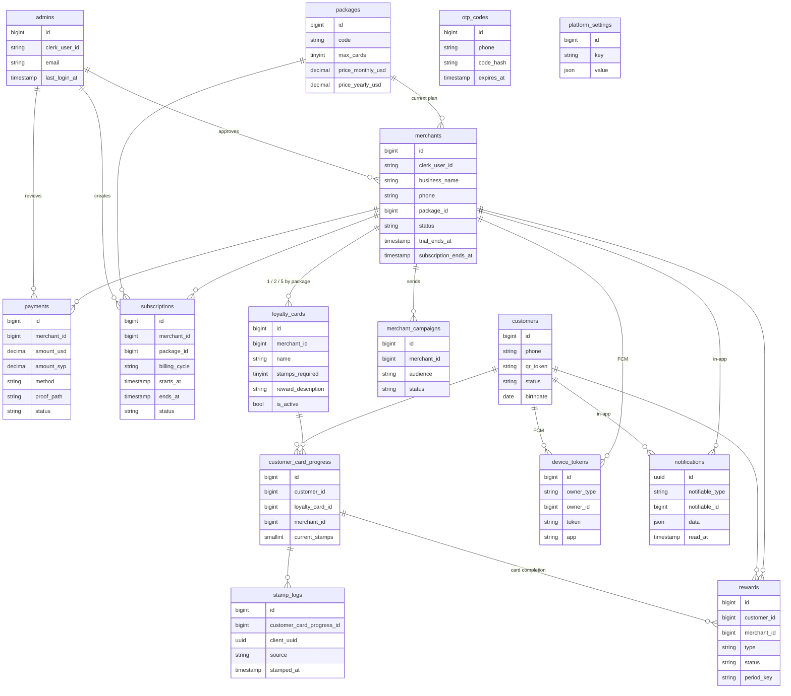

# Database Schema

Implements the conceptual data model from PRD v1.4 (section 8) on MySQL 8.4.
Migrations live in `database/migrations`, models in `app/Models`, status values
in `app/Enums`.

## Conventions

- Status and type columns are plain strings backed by PHP enums (`app/Enums`),
  not MySQL `ENUM`, so new values need no schema change.
- Money is `decimal`. Package prices are in USD; payments also record the SYP
  amount and the exchange rate used.
- Phone numbers are stored in E.164 format (`+9639XXXXXXXX`).
- Files (logos, payment proofs) are stored as relative `*_path` values, ready
  for Cloudflare R2.
- Polymorphic columns store short aliases (`admin`, `merchant`, `customer`), set
  by the morph map in `AppServiceProvider`.
- **No passwords are stored.** Customers sign in with phone + OTP. Merchants and
  admins sign in through Clerk and are linked by `clerk_user_id` (the Clerk
  token's `sub`).

## Entity relationships

## Tables

| Table | Purpose | Key constraints |
|---|---|---|
| `admins` | Platform admins, signed in through Clerk | `email` unique, `clerk_user_id` unique |
| `packages` | Basic / Standard / Premium, limited by `max_cards` only | `code` unique |
| `merchants` | One account = one business, signed in through Clerk | `phone`, `email`, `clerk_user_id` unique; soft deletes |
| `subscriptions` | Every trial, paid period and admin plan change | index `(merchant_id, ends_at)` |
| `payments` | Manual transfers with proof, reviewed by the admin | index `(merchant_id, status)`, `(status, created_at)` |
| `loyalty_cards` | A merchant's offers (e.g. hot drinks) | index `(merchant_id, is_active)`; soft deletes |
| `customers` | Customer identity by phone; one permanent `qr_token` | `phone`, `qr_token` unique |
| `otp_codes` | Hashed WhatsApp login codes | index `(phone, created_at)` |
| `customer_card_progress` | A customer's stamps on one card | **unique `(customer_id, loyalty_card_id)`** |
| `stamp_logs` | Every stamp operation | **`client_uuid` unique** |
| `rewards` | Card-completion rewards and birthday gifts | **unique `(customer_id, merchant_id, type, period_key)`** |
| `notifications` | Laravel database notifications = in-app notification center | — |
| `device_tokens` | FCM push tokens for both apps | `token` unique |
| `merchant_campaigns` | Manual promotions sent by merchants | index `(merchant_id, created_at)` |
| `platform_settings` | Admin-editable values (`trial_days`, `subscription_reminder_days`) | `key` unique |

## Business rules the schema enforces

- **Auto-enrollment (PRD 7.1):** the first stamp creates the
  `customer_card_progress` row. Its unique pair means two simultaneous scans can
  never enroll the same customer twice on one card.
- **Offline sync (PRD 9):** the merchant app sends a UUID per stamp operation;
  replaying a sync fails on `stamp_logs.client_uuid` instead of double-stamping.
- **Pending customers (PRD 7.1 C/D):** a merchant can add a customer by phone
  only. The row has `status = pending` and no `qr_token`. When the customer
  verifies the same number by OTP, the same row becomes `active` and gets its
  `qr_token`, so all accumulated progress stays attached.
- **One Clerk user, one business:** `merchants.clerk_user_id` is unique, so a
  Clerk user can register at most one business even under concurrent requests.
- **Admin access is explicit:** merchants and admins share one Clerk application,
  so a Clerk account alone grants nothing — admin access requires a row in
  `admins` with that `clerk_user_id`.
- **Birthday gifts (PRD 4.8):** `period_key` stores the year, so the daily job
  can gift a customer at most once per merchant per year. Card rewards leave it
  null and can repeat.
- **Admin-only plan changes (PRD 4.2):** a merchant's `package_id`, `status`,
  Clerk link, approval and subscription dates are not mass assignable. Each
  change is a new `subscriptions` row, which is the audit trail.
- **Financial history is kept:** `subscriptions` and `payments` block hard
  deletion of their merchant; merchants are soft deleted.

## Rules enforced in application code

- Registration starts the merchant on a free trial immediately (PRD 4.1):
  `status = trial`, `trial_ends_at = now + platform_settings.trial_days`, and a
  `trial` subscription row for the same period.
- A merchant's number of active cards must not exceed `packages.max_cards`
  (check inside a transaction when creating or activating a card).
- Stamp flow (PRD 3.3): stamps accumulate on `current_stamps`. Reaching
  `stamps_required` creates a `ready` reward; the counter resets to zero when
  the merchant confirms the reward was collected (`redeemed`).
- `merchant_id` on progress, stamp logs and rewards is a copy of the card's
  owner, kept for merchant stats without joins; always copy it from the card.

## Open PRD questions reflected as placeholders

- Package prices (10 / 17 / 35 USD) and yearly prices (empty) — PRD 11.
- Trial length `trial_days = 14` in `platform_settings` — PRD 11.
