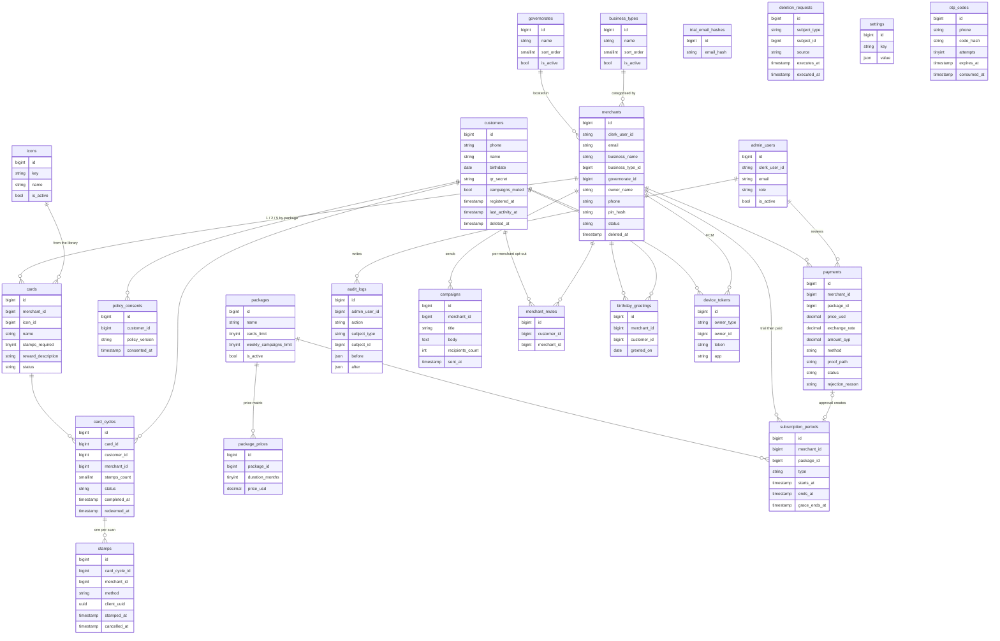

# Database Schema

Implements the data model of the Wafa requirements document (v1.0, Deep Code,
22 Sep 2026) on MySQL 8.4. The domain lives in one migration,
`database/migrations/2026_09_22_213702_create_wafa_core_schema.php`, followed by
two small ones (`merchants.email`, and account deletion on `customers`); models
are in `app/Models` and status values in `app/Enums`.

## The two ideas behind the design

1. **What never changes is referenced, what changes is copied.** A cycle points
   at its card, and the card is never edited — only suspended — so a reward
   promised two years ago still reads correctly. A payment, by contrast, copies
   the package name, duration, USD price, exchange rate and SYP amount, because
   the price list will move and the receipt must not.
2. **Progress is a row per cycle, not a counter.** `card_cycles` holds one row
   from the first stamp to the reward being handed over. Redemption closes that
   row and the next stamp opens a new one, so completed cards stay readable as
   history instead of being erased by a counter reset.

## Conventions

- Status and type columns are plain strings backed by PHP enums (`app/Enums`),
  not MySQL `ENUM`, so adding a value needs no schema change.
- Money is `decimal`. Package prices are USD; payments also record the SYP amount
  and the exchange rate used.
- Phone numbers are stored in E.164 (`+9639XXXXXXXX`).
- Files (logos, payment proofs) are relative `*_path` values, ready for
  Cloudflare R2.
- Operational numbers (trial length, grace days, stamp limits, QR period, policy
  version, minimum app version) live in `settings` and are read at runtime, not
  hard-coded.
- **No passwords are stored.** Customers sign in with phone + OTP; merchants and
  admins through Clerk, linked by `clerk_user_id` (the token's `sub`).

## Entity relationships

## Tables

### Managed lists

`governorates` (the 14 Syrian governorates), `business_types`, `icons` — edited
from the dashboard and **deactivated, never deleted**, so rows that reference
them keep resolving. `settings` is a key/JSON store for runtime values.

### Identity

**`customers`** — `phone` is unique and is the identity. `registered_at` null
means a **pending customer**: a row a merchant created from a phone number alone.
When that person installs the app and verifies the number, the same row is filled
in — merging is filling fields, never moving stamps. `qr_secret` is the seed the
app uses to generate a QR code that rotates every `qr_period_seconds`, offline.
`last_activity_at` drives the 12-month purge of pending customers required by the
privacy policy.

Deleting an account (privacy policy §10) empties the row in place — phone, name,
birthdate and QR secret become null — and soft deletes it; tokens, devices,
consents and preferences are removed. The row stays so its stamps and cycles keep
counting in merchant statistics without pointing at anyone. `phone` is nullable
for that reason, and the same number can sign up again as a new row. Each
deletion is recorded in `deletion_requests`.

**`policy_consents`** — one row per accepted policy version, unique per customer
and version. A new version asks again.

**`admin_users`** — dashboard staff, `role` one of `super_admin`, `admin`,
`payments_reviewer`, `support`. Separating the payments reviewer is a
requirement, not a convenience. A super admin adds a row by name, email and
role; `clerk_user_id` stays null until someone signs in to Clerk with that email.
Accounts are deactivated (`is_active`), never deleted, so the audit trail keeps
its author.

### Merchant

**`merchants`** — one account shared by the owner and the cashier, with the
sensitive tabs behind `pin_hash`. `email` is the address the merchant signs in to
Clerk with, copied from the session token (never from request input) and kept in
step on each app start; support uses it to find and contact the shop. Registration fills the row in three steps, so
`status` stays null until a package is chosen and `pin_hash` until the PIN is
set. `status` then moves through `TRIAL → ACTIVE → GRACE → EXPIRED`, with
`SUSPENDED`, `PENDING_DELETION` and `DELETED` alongside. Soft-deleted.

**`trial_email_hashes`** — an HMAC fingerprint of the Clerk email, with
**no foreign key on purpose**: it outlives the account, so deleting and signing
up again cannot buy a second free trial. The plain email is never stored.

### Packages, subscriptions and payments

**`packages`** carry `cards_limit` and `weekly_campaigns_limit`;
**`package_prices`** is the price matrix, one row per (package, duration) with
`unique(package_id, duration_months)`.

**`subscription_periods`** — a row per period keeps the full history. A renewal
extends from the previous `ends_at`, not from the approval date, so a merchant who
pays early loses nothing. `grace_ends_at` follows a paid period only, never a
trial.

**`payments`** — prices are copied in when the proof is uploaded. `status` is
`PENDING` / `APPROVED` / `REJECTED` with `rejection_reason` from a closed list,
and approval links the row to the `subscription_period` it created.

### Cards, cycles and stamps

**`cards`** — a published card is never edited, only suspended. The reward text
and the number of stamps are a promise to customers who already started
collecting.

**`card_cycles`** — `status` is `COLLECTING` → `REWARD_READY` → `REDEEMED`.
`merchant_id` is copied from the card so merchant lists and statistics avoid a
join.

**`stamps`** — one row per scan. `client_uuid` is generated by the merchant app
per operation, so a double tap or a retried request can never add two stamps. A
cancelled stamp is marked with `cancelled_at`, never deleted, so a dispute can be
read after the fact.

### Campaigns, requests and audit

`campaigns` (counted per week against the package limit), `merchant_mutes`
(per-merchant opt-out, alongside the global `customers.campaigns_muted`),
`birthday_greetings` (unique per merchant, customer and day),
`deletion_requests` (subject is a type plus an id, since both customers and
merchants request deletion), and `audit_logs` (who did what to whom, with the
before/after snapshot; append-only, so no `updated_at`).

## Three unique indexes that carry business rules

MySQL has no partial indexes, so two rules are enforced through generated
columns that hold a value only while the rule applies and `NULL` otherwise —
and `NULL` never equals `NULL` in a unique index. Both columns are **virtual**,
not stored, because MySQL refuses cascading foreign keys on the base columns of
a stored generated column.

| Rule | How |
|---|---|
| One stamp per operation | `stamps.client_uuid` unique |
| One pending payment per merchant | `payments.pending_for_merchant` = `merchant_id` while `status = 'PENDING'`, unique |
| One open cycle per (card, customer) | `card_cycles.open_card_id` + `open_customer_id` carry the pair until `REDEEMED`, unique together |

The same expressions work on SQLite, which the test suite uses in memory.

## Seeded data

`php artisan db:seed` loads the 14 governorates, the business types, the icon
library, the packages with their price matrix, the runtime settings (trial days,
grace days, stamp range, QR period, privacy policy version, minimum app version)
and the first `super_admin` from `.env`. `DemoSeeder` adds a demo merchant,
card, customers and stamps for local work; it is not part of `DatabaseSeeder`.

## Privacy rules the schema enforces

- Minimum age 13 — checked at registration against `birthdate`.
- Consent is versioned in `policy_consents`, not a boolean.
- A pending customer with no activity for 12 months is purged
  (`last_activity_at`).
- A customer's phone number never leaves the server in a merchant-facing
  response, and the birth **year** is never sent to the merchant app.
